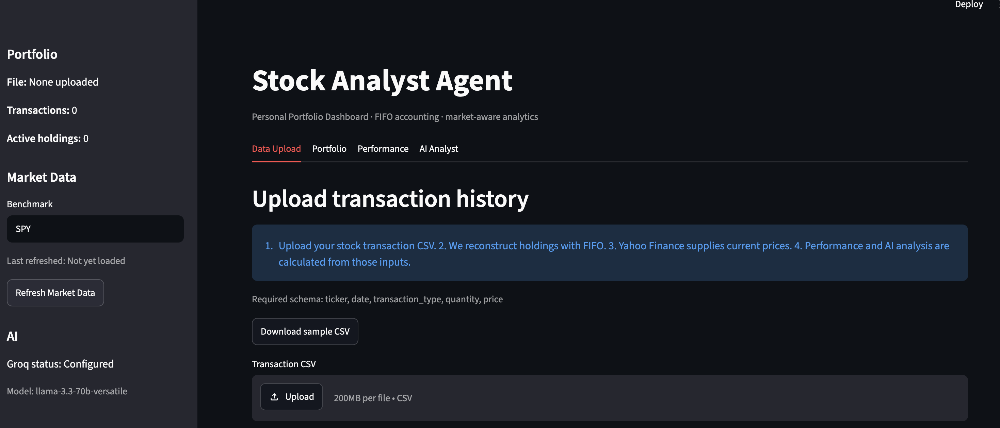
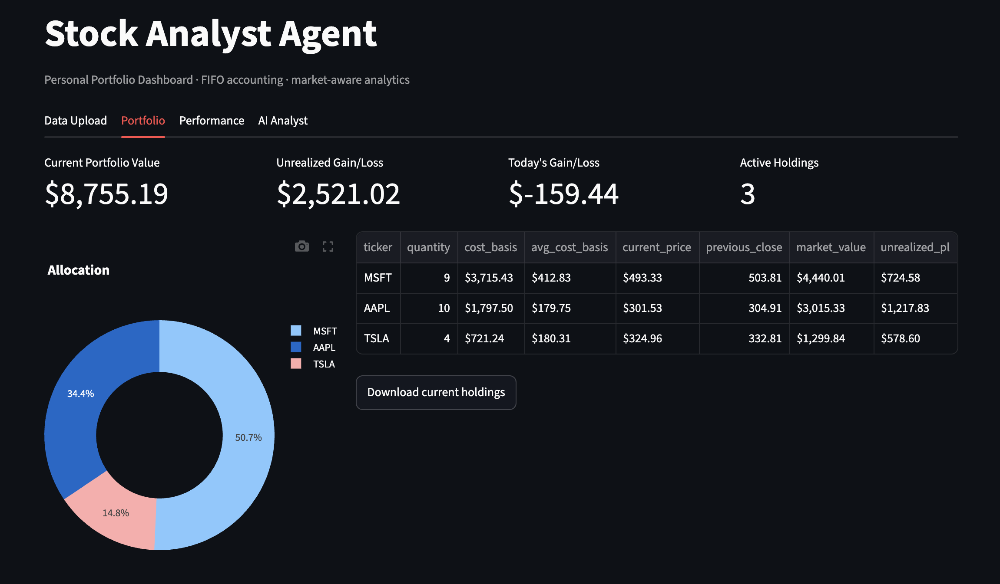
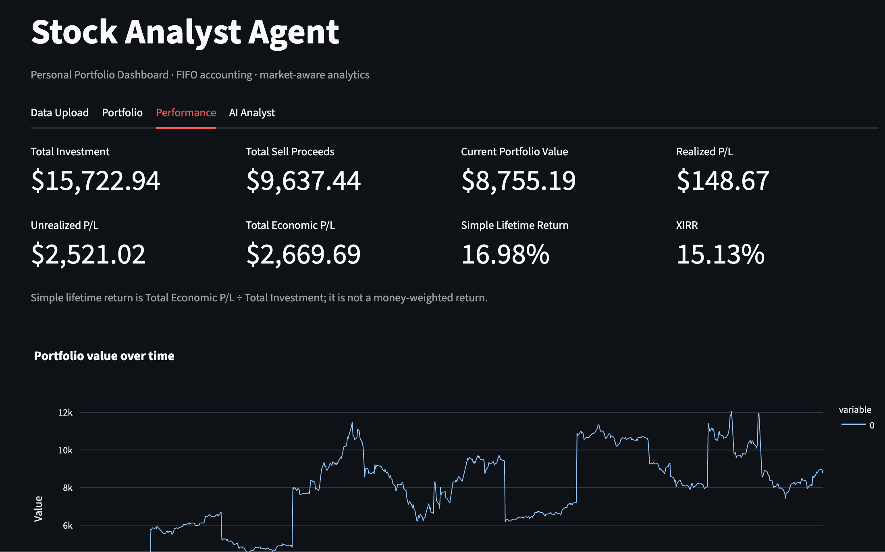
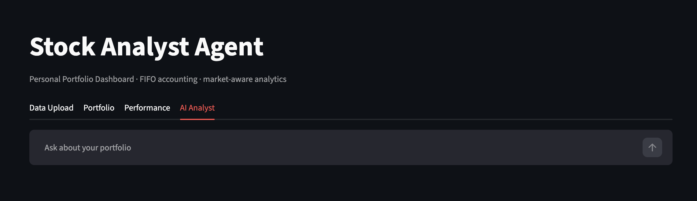

# Stock Analyst Agent

Phase 1 is a personal US-stock portfolio dashboard. Upload transaction history, reconstruct open positions using deterministic FIFO accounting, retrieve Yahoo Finance prices, review lifetime performance against a benchmark, and optionally ask a Groq-powered analyst about the calculated results.

## Screenshots

### Data upload



### Portfolio



### Performance



### AI analyst



## Features

- Strict CSV validation, including chronological oversell detection.
- FIFO lot accounting with realized and unrealized P/L kept separate.
- Current holdings, allocation, concentration (largest position, top-three weight, HHI), winners/losers, and ticker drilldown.
- Current and historical Yahoo Finance data with cached, batch-oriented requests and refresh control.
- Historical portfolio value, normalized benchmark comparison, realized P/L history, XIRR, and risk statistics where enough data exists.
- Optional Groq health summary and chat. The model receives calculated, compact context only; it does not calculate portfolio figures.

## Architecture

- `utils/data_processing.py`: CSV validation and transaction normalization.
- `utils/portfolio_math.py`: pure FIFO accounting and financial calculations.
- `utils/market_data.py`: cached Yahoo Finance retrieval.
- `utils/llm_agent.py`: Groq client, prompts, and compact context construction.
- `components/`: Streamlit presentation for each tab.
- `tests/`: deterministic unit tests with no live market-data calls.

## Setup and run

Requires Python 3.12+ and [uv](https://docs.astral.sh/uv/).

```bash
git clone https://github.com/canreddy/stock-analyst-agent.git
cd stock-analyst-agent
uv sync
cp .env.example .env
uv run streamlit run app.py
```

Set `GROQ_API_KEY` in `.env` to enable AI features. Without it, the dashboard and all deterministic calculations continue to work.

Run tests with:

```bash
uv run pytest
```

## CSV schema

```csv
ticker,date,transaction_type,quantity,price
AAPL,2024-01-10,Buy,10,185.20
MSFT,2024-02-15,Buy,5,402.10
AAPL,2024-06-01,Sell,3,195.50
```

`transaction_type` must be `Buy` or `Sell`; quantities and prices must be positive. Tickers are normalized to uppercase. A sale may not exceed shares available at that point in chronological history.

## Calculation methodology

Sales consume the oldest open purchase lot first (FIFO). Realized P/L is sale proceeds less the exact cost of shares consumed. Remaining lots determine current cost basis and unrealized P/L. Total economic P/L is sell proceeds plus current portfolio value minus all buy investment. The displayed simple lifetime return is economic P/L divided by total investment.

XIRR is the money-weighted annual return: buys are negative cash flows, sells positive cash flows, and the current portfolio value is a positive terminal cash flow today. It is shown as N/A when the cash-flow pattern has no valid mathematical solution.

## Limitations and disclaimer

Yahoo Finance data may be delayed, incomplete, unavailable for delisted symbols, or temporarily fail. This application handles partial data but cannot guarantee quote accuracy. Groq can be unavailable and its educational interpretations should be reviewed critically. This is not investment, tax, or financial advice; verify all results independently before making decisions.
